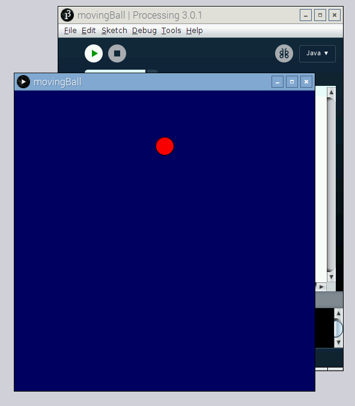

## Make things move

Up until now, you've been writing sketches that draw a single thing and then they're done, but Processing is a powerful language that lets you create animations and respond to inputs. In this section, you'll learn how to get things to move on screen.

In order to create movement, you'll need to define two special functions: `setup` and `draw`. The code you write in the `setup` function is only executed once when your sketch starts. Afterwards, the code you write in the `draw` function is executed over and over again until you terminate the sketch. This is the basic structure of most of the Processing sketches you'll write:

```java
void setup() {
	// the code here will only be executed once.
}

void draw() {
	// the code here will be executed over and over again.
}
```

- Enter the following code into a new Processing sketch and run it. The text after the double slashes are comments to help you understand what each line is doing; they'll be ignored by Processing.

	```java
	// Create an integer variable called i and store the value 0 in it:
	int i = 0;

	void setup() {
	  // Create a 500 pixel by 500 pixel window:
	  size(500, 500); 
	}

	void draw() {
	  // Set the background to blue:
	  background(0, 0, 100);

	  // Set the fill to red:
	  fill(255, 0, 0);

	  // Draw a circle. Its y coordinate will be taken from the variable i:
	  ellipse(250, i, 30, 30);

	  // Update the variable i:
	  if (i < height) { // if it's less than the height of the window:
	    i = i + 1; // then add 1 to its value
	  }
	  else { // otherwise (if it's greater than or equal to the height of the window): 
	    i = 0; // set it back to zero.
	  }
	}
	```

	You should see a circle moving downwards. When it gets to the bottom, it resets to the top again. It will move like this forever.

	There are a few new concepts in this sketch. Let's take a closer look now at what's going on.

	The line `int i = 0;` sets up a **variable**; this is a spot in memory to hold an **integer**, which is a whole number. It calls that spot in memory `i` and sets its value to 0. Later in the sketch, your code will read that value and update it.

	When Processing draws the ellipse in the line `ellipse(250, i, 30, 30);`, it uses the current value of `i` as the y coordinate for the circle.

	

- Further down, the line `i = i + 1;` sets a new value for `i`, incrementing it by 1. Try changing that line to `i = i + 2;`. What do you think will happen when you run the sketch? Also try `i = i + 5;`.

- The line that changes the value of `i` is wrapped up in an **if/else statement**. It checks to see if the value of `i` is greater than the height of the window. If it is, it sets the value back to zero. This ensures that the circle goes back to the top of the window after it has moved to the bottom. Try adjusting the `if/else` statement and the line that updates the value of `i`, to make the ball move upwards repeatedly.

- The line `background(0, 0, 100);` fills the window with blue. The [background function](https://processing.org/reference/background_.html) takes red, green, and blue parameters, just like other functions that deal with colour. It's important to call this function at the start of every draw block if you want the previously drawn circles cleared from the window. Try running the sketch without the background function to see the effect.

- Try to work with variables and other parameters such as x position, colour, height, and width.

