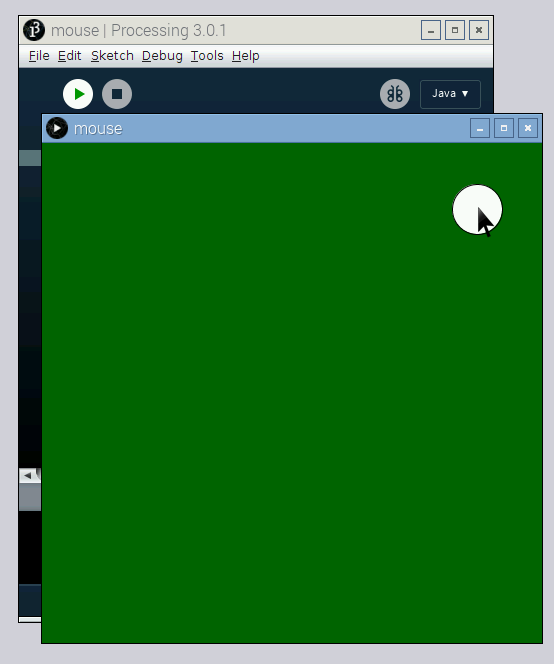

## Respond to the mouse

There are many ways to have a Processing sketch listen to inputs to make it interactive; the mouse is just one way. In this section, you'll learn how to listen for mouse clicks and get the position of the mouse.

- Create a new sketch with the following code:

	```java
	int x = 0;
	int y = 0;

	void setup() {
	 size(500, 500);

	 // Set the value of x to be half the width of the window
	 x = width / 2;

	 // Set the value of y to be half the height of the window
	 y = height / 2;
	}

	void draw () {
	 background(0, 100, 0);

	 // Draw the circle in the position taken from the x and y variables:
	 ellipse(x, y, 50, 50);
	}

	void mousePressed() {
	  // When the mouse is pressed, update x and y
	  // to contain the current position of the mouse:
	  x = mouseX;
	  y = mouseY;
	}
	```

	The code above uses a few special variables that all Processing sketches have "built-in": `height`, `width`, `mouseX`, and `mouseY`. The `height` and `width` variables refer to the height and width of the window. The `mouseX` and `mouseY` variables contain the position of the mouse pointer.
	
	*Note: You also used the `height` variable in the previous sketch, to check the position of the circle in relation to the bottom of the window.*

	The code also creates a special function called `mousePressed()` that is executed when either mouse button is pressed. This is an example of **event-driven programming**.

- Run the sketch and click anywhere in the window to see the circle move to that position!

	

- Try updating the code to use `mouseX`, `mouseY`, and `mousePressed` to change the size or colour of a shape.
