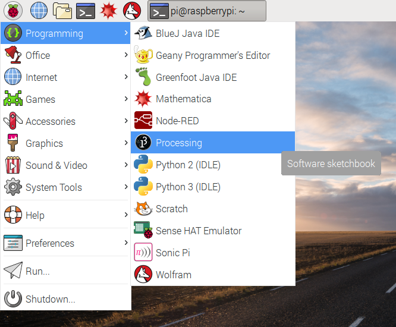
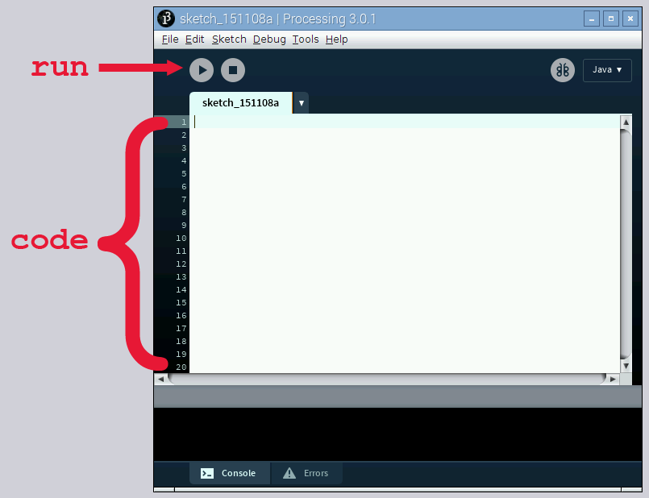
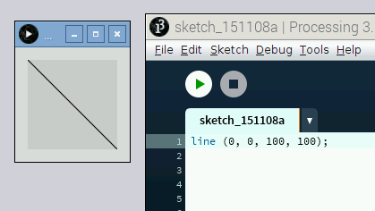
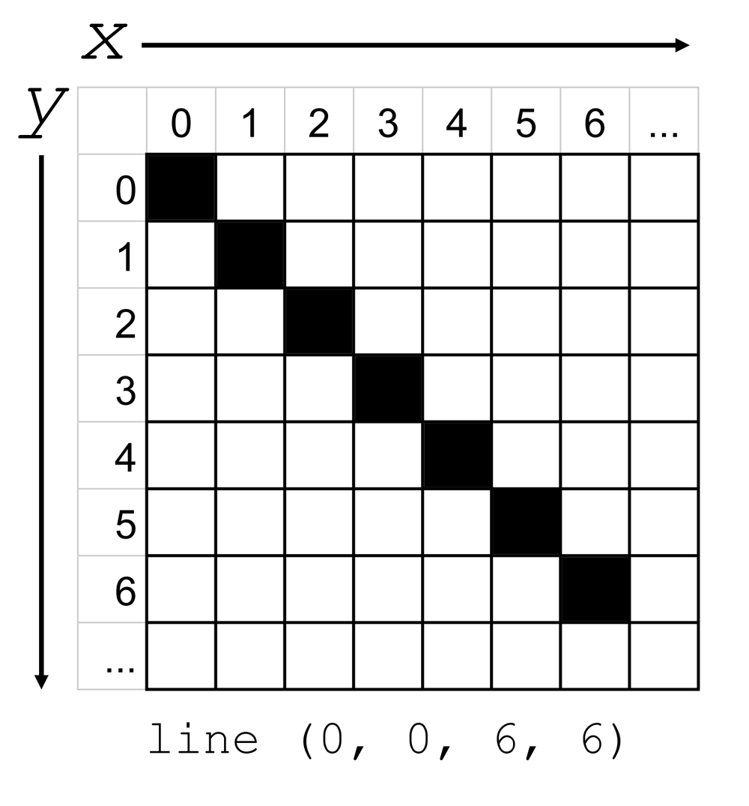

## Write your first Processing sketch

- To start Processing, click on **Menu** -> **Programming** -> **Processing**.



The main Processing window is where you'll type your code, and the **Run** button is how you'll execute that code. In the world of Processing, the program you write is called a **sketch**. Create your first simple sketch:



- Enter the following code in the window:

	```java
	line(0, 0, 100, 100);
	```

- Click on the **Run** button. A new window should appear with a box and a diagonal line.

	

	The [line function](https://processing.org/reference/line_.html) draws a line between two points in the window. It takes four inputs: `x1` and `y1` for the start of the line, and `x2` and `y2` for the end of the line. Its syntax is:

	```java
	line(x1, y1, x2, y2);
	```

	To understand what this means, you'll need to know that Processing uses a coordinate system like the one shown below. Note that the numbering begins at 0, not 1. Also, the origin is in the top-left, rather than the bottom-left as you may be used to.

	

- Try entering different values into the `line` function and press **Run**. Below are a few ideas to try. Can you guess what the output will look like *before* you execute the code?

	```java
	line(0, 50, 100, 50);
	line(50, 0, 50, 100);
	line(90, 10, 10, 90);
	```

- Processing will execute one line of code at a time, starting at the top of the sketch and working downward. This is called **procedural programming**. Try calling the `line` function a few different times, with a few different values in a single sketch.

- When you click **Run**, you'll notice that Processing draws each line you entered on the window.

	*Note: Processing will alert you to mistakes or when it can't make sense of a statement because of a syntax error. It will highlight the line and print out helpful information in the Message area and Console at the bottom of the window.*
