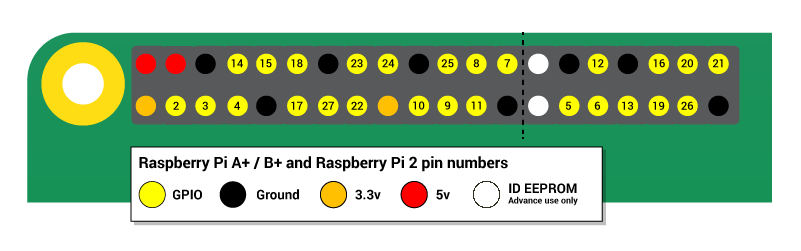
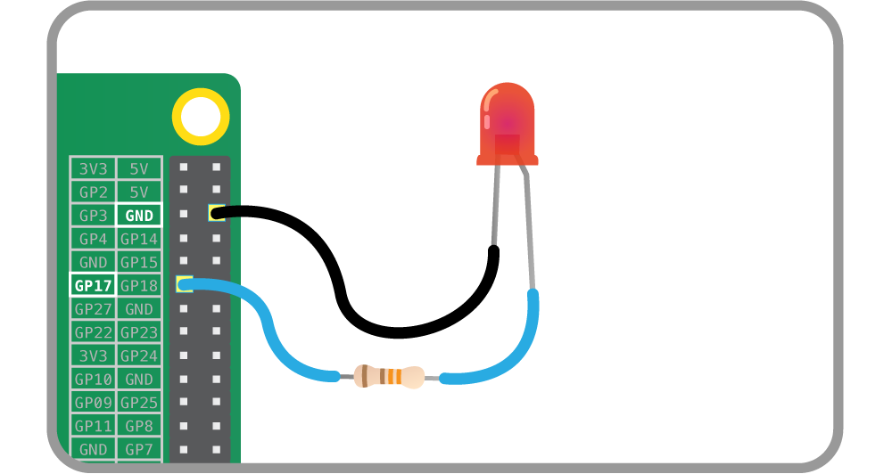

## Control an LED

Throughout this worksheet, you'll be using the GPIO header on the Raspberry Pi. Only the numbered pins below may be used as inputs and outputs.



- Wire up an LED and a 330 ohm resistor to GPIO pin 17, as shown below. If you need more guidance, follow [this guide](https://projects.raspberrypi.org/en/projects/physical-computing-guide).

	

- Enter the code below into a new sketch and run it:

	```java
	import processing.io.*; // use the GPIO library

	// store the desired state of the LED in a variable
	boolean ledOn = false; 

	void setup() {
	  // set pin 17 as an output:
	  GPIO.pinMode(17, GPIO.OUTPUT);  
	}

	void draw() {
	  if (ledOn == true) { // If the desired state is on, then:

	  	// turn the LED on:
	    GPIO.digitalWrite(17, GPIO.HIGH);

	    // and set the background red:
	    background(255, 0, 0);
	  }

	  else { // otherwise:

	  	// turn the LED off:
	    GPIO.digitalWrite(17, GPIO.LOW);

	    // and set the background black:
	    background(0, 0, 0);
	  }
	}

	void mouseClicked() {
	  // When the mouse is clicked, store the opposite of 
	  // ledOn into ledOn, which toggles ledOn:
	  ledOn = !ledOn;
	}
	```

- When you click in the window, the background will turn red and the LED will turn on. When you click again, they will both toggle back to their original state.

- Try wiring up more LEDs and see if you can control them independently by clicking on different parts of your sketch window.

