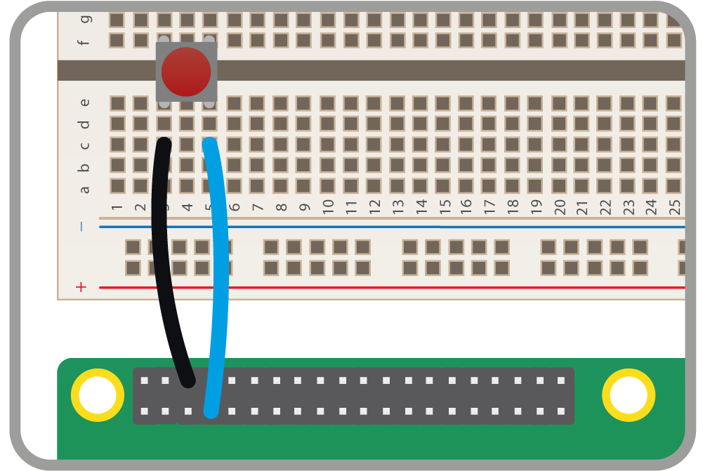

## React to a button

- Wire up a button to GPIO pin 4, as shown below. If you need more guidance, follow [this guide](https://projects.raspberrypi.org/en/projects/physical-computing-guide).

	

- Enter the code below into a new sketch and run it.

	```java
	import processing.io.*;

	void setup() {
	  // set pin 4 as an input:
	  GPIO.pinMode(4, GPIO.INPUT);
	}

	void draw() {
	  if (GPIO.digitalRead(4) == GPIO.HIGH) { // if the pin is HIGH, the button isn't pressed
	    
	    // set the background to black:
	    background(0, 0, 0);

	  } else { // if the button is pressed:

	  	// set the background to red:
	    background(255, 0, 0);
	  }
	}
	```

- When you press and hold the button down, the background of the sketch window will turn red. When you let go, it will go back to black.

- Try wiring up a few more buttons to control the motion or colour of a few different shapes.

