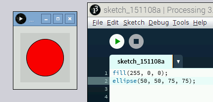
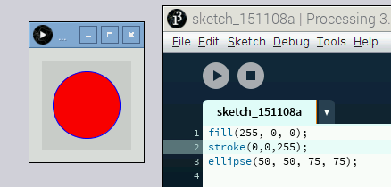

## Add colour

You may have noticed that the ellipse and rectangle you drew had black outlines and were filled with white. It would be boring if that was the only option, right? In this section, you'll learn how to change the **stroke** (the outline) and the **fill** (the solid colour inside the shape).

There are lots of ways for us to describe colours to a computer. With Processing you'll usually use an **RGB value**, which describes colours by stating how much red, green, and blue are in them.

- To try it out, run the following code to draw a circle with a red fill:

	```java
	fill(255, 0, 0);
	ellipse(50, 50, 75, 75);
	```

	

	After you call the `fill` function, any shapes drawn after that function will have that colour fill, until you call the `fill` function again with a different colour. The syntax for `fill` is:

	```java
	fill(red, green, blue);
	```
	
	Each primary colour can have the value 0 to 255. 0 means no presence of the colour and 255 is the maximum amount of that colour.

- Try to change the values of the `fill` function, and re-run your code to try making other colours. Remember that you may need to mix colours together!

- To change the colour of the outline, use the [stroke function](https://processing.org/reference/stroke_.html). It uses the same colour parameters as the `fill` function:

	```java
	stroke(red, green, blue);
	```

	Try changing the stroke of the circle.

	

- And if you want to get rid of the stroke or fill, use the [noStroke](https://processing.org/reference/noStroke_.html) and [noFill](https://processing.org/reference/noFill_.html) functions. Keep in mind that if you use them both at the same time, you won't be able to see what you're drawing! Try them out on the circle above.

- Use what you now know about `fill`, `stroke`, `noFill`, and `noStroke` to draw something like the Olympic rings, a giraffe, or a Raspberry Pi!

	*Note: By default, all lines are 1 pixel wide. To increase the thickness of the line, use the [strokeWeight function](https://processing.org/reference/strokeWeight_.html). As with the colour functions, after you call it, all shapes you draw will have your specified thickness until `noStroke` is called, or `strokeWeight` is called with a different value. The syntax is:*

	```java
	strokeWeight(width);
	```

