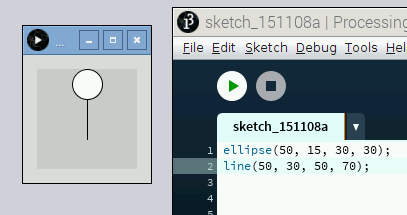

## Draw other shapes

Of course, you can do a lot with lines, but Processing can draw a lot of different shapes. In these steps, you'll learn how to draw a circle and a rectangle.

- Enter the following code in a blank sketch and press **Run**:

	```java
	ellipse(50, 15, 30, 30);
	```

	The [ellipse function](https://processing.org/reference/ellipse_.html) draws an ellipse (oval). An ellipse with equal width and height is more commonly known as a circle. The syntax for the `ellipse` function is:

	```java
	ellipse(xPosition, yPosition, width, height);
	```
	
- Try changing the values of the ellipse and running your sketch, to see how each value affects the shape.

- If you go back to the original ellipse you drew, it looked like the start of a stick figure, don't you think? Try using the `line` function to draw the rest of the person. Here's a hint to get you started:

	```java
	ellipse(50, 15, 30, 30);
	line(50, 30, 50, 70);
	```

	

- Even though you can draw a rectangle using just four lines, there's a [rectangle function](https://processing.org/reference/rect_.html) to make it easier. Its syntax is:

	```java
	rect(xPosition, yPosition, width, height);
	```

- Try drawing a box around your stick figure. At this stage, it's important to note that as your code is executed, Processing draws shapes on top of previously drawn shapes. Therefore, you may want to execute the `rect` function before the code to draw your stick figure.

	*Note: If you ever forget how to use a function, you can always right-click on it in your code and click on "Find in Reference." This will open up a local copy of the Processing reference for that function.*

