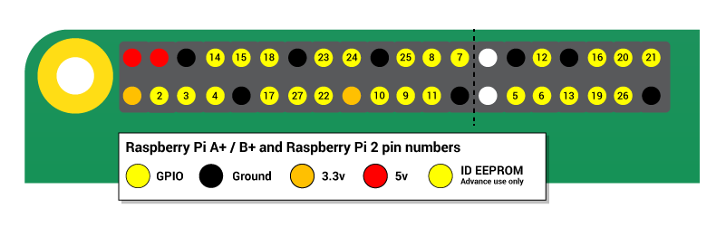
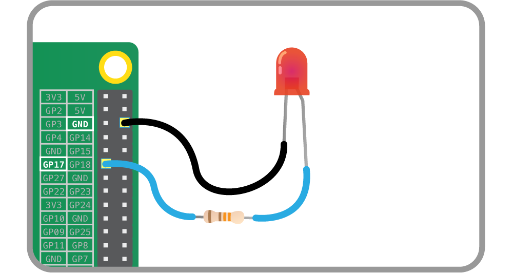
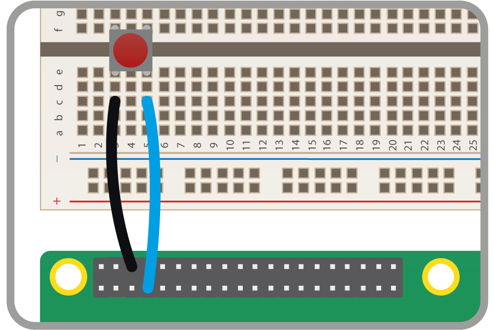

# Taking Processing further with physical computing

Processing is so awesome that there are too many features to mention in just one tutorial! If you feel like you've got to grips with the [first page](worksheet.md), and you would like learn how to use [Processing for physical computing](https://www.processing.org/reference/libraries/io/index.html), then follow the steps below.

This worksheet will show the basics of input and output with Processing. To get a deeper understanding of what you can do with physical computing, check out the [physical computing guide](https://github.com/raspberrypilearning/physical-computing-guide).

## Control an LED

Throughout this worksheet, you'll be using the GPIO header on the Raspberry Pi. Only the numbered pins below may be used as inputs and outputs.



1. Wire up an LED and a 330 ohm resistor to GPIO pin 17, as shown below. If you need more guidance, follow [this guide](https://github.com/raspberrypilearning/physical-computing-guide).

	

1. Enter the code below into a new sketch and run it:

	```java
	import processing.io.*; // use the GPIO library

	// store the desired state of the LED in a variable
	boolean ledOn = false; 

	void setup() {
	  // set pin 17 as an output:
	  GPIO.pinMode(17, GPIO.OUTPUT);  
	}

	void draw() {
	  if (ledOn == true) { // If the desired state is on, then:

	  	// turn the LED on:
	    GPIO.digitalWrite(17, GPIO.HIGH);

	    // and set the background red:
	    background(255, 0, 0);
	  }

	  else { // otherwise:

	  	// turn the LED off:
	    GPIO.digitalWrite(17, GPIO.LOW);

	    // and set the background black:
	    background(0, 0, 0);
	  }
	}

	void mouseClicked() {
	  // When the mouse is clicked, store the opposite of 
	  // ledOn into ledOn, which toggles ledOn:
	  ledOn = !ledOn;
	}
	```

1. When you click in the window, the background will turn red and the LED will turn on. When you click again, they will both toggle back to their original state.

1. Try wiring up more LEDs and see if you can control them independently by clicking on different parts of your sketch window.

## React to a button

1. Wire up a button to GPIO pin 4, as shown below. If you need more guidance, follow [this guide] (https://github.com/raspberrypilearning/physical-computing-guide).

	

1. Enter the code below into a new sketch and run it.

	```java
	import processing.io.*;

	void setup() {
	  // set pin 4 as an input:
	  GPIO.pinMode(4, GPIO.INPUT);
	}

	void draw() {
	  if (GPIO.digitalRead(4) == GPIO.HIGH) { // if the pin is HIGH, the button isn't pressed
	    
	    // set the background to black:
	    background(0, 0, 0);

	  } else { // if the button is pressed:

	  	// set the background to red:
	    background(255, 0, 0);
	  }
	}
	```

1. When you press and hold the button down, the background of the sketch window will turn red. When you let go, it will go back to black.

1. Try wiring up a few more buttons to control the motion or colour of a few different shapes.

## What next?

- Learn more about the [Processing Hardware I/O library here](https://www.processing.org/reference/libraries/io/index.html).
- Try using code to create a piece of animated artwork.
- Do you have any other electronic components to wire up and use with Processing?
- Why not take a look at the [Exhibition section](https://processing.org/exhibition/) of Processing.org and get inspired for your next project?
- Adapt another [physical computing project](https://www.raspberrypi.org/resources/make/) to use Processing instead of Scratch or Python.

